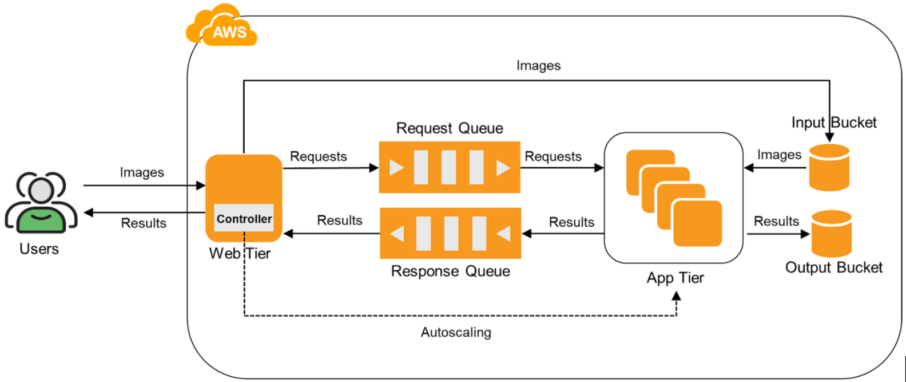

# Cloud Face Recognition Project

## Phase 2
An elastic face recognition application using the IaaS resources from AWS. The application tier of the multi-tiered cloud application, uses a machine learning model to perform face recognition, and implement autoscaling to allow the application tier to dynamically scale on demand.



### Request API cURL

```
curl --location '<base_url>:<port>>/' \
--form 'inputFile=@"<file_location>"'
```

## Phase 1
A Cloud Application on AWS for Face Recognition. The project has two components: Web Tier and App Tier.

### Simple DB Setup
 
Populate the data from CSV into the SimpleDB

### Web Tier

Receives input files to perform face recognition.
In phase 1 of the project, the data is retrieved from AWS SimpleDB.

#### Run Commands

- Use Gunicorn to run the server.py
- Create systemd service files
- Run below commands to run the server:
```
sudo systemctl start server
sudo systemctl status server
```

