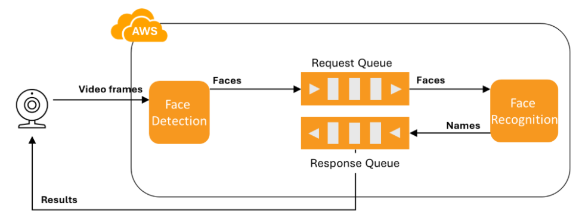
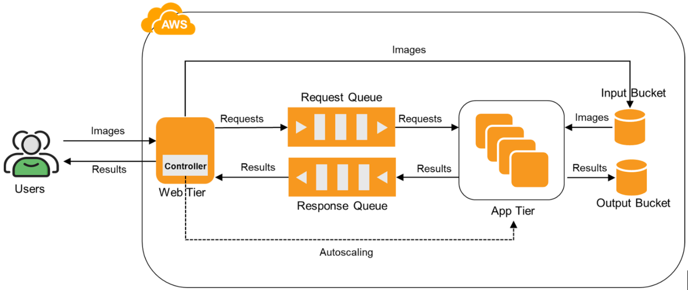

# Cloud Face Recognition Project

## Phase 3
A Cloud application using AWS PaaS resources (AWS Lambda) to provide face recognition as a service on video frames streamed from the clients (e.g., security cameras). The project implement a multi-stage pipeline to recognize faces in video frames collected from Internet of Things (IoTs) such as smart cameras.
- The pipeline starts with a client, which represents an IoT, sending video frames to the cloud app. 
- The face-detection function accepts video frames from the client, performs face detection using a machine learning model, and produces the detected faces.
- The face-recognition function performs face recognition on the detected faces using a machine learning model, and produces the names of the recognized faces. 
- The names of the recognized faces are sent back to the client.




## Phase 2
An elastic face recognition application using the IaaS resources from AWS. The application tier of the multi-tiered cloud application, uses a machine learning model to perform face recognition, and implement autoscaling to allow the application tier to dynamically scale on demand.



### Request API cURL

```
curl --location '<base_url>:<port>>/' \
--form 'inputFile=@"<file_location>"'
```

## Phase 1
A Cloud Application on AWS for Face Recognition. The project has two components: Web Tier and App Tier.

### Simple DB Setup
 
Populate the data from CSV into the SimpleDB

### Web Tier

Receives input files to perform face recognition.
In phase 1 of the project, the data is retrieved from AWS SimpleDB.

#### Run Commands

- Use Gunicorn to run the server.py
- Create systemd service files
- Run below commands to run the server:
```
sudo systemctl start server
sudo systemctl status server
```

