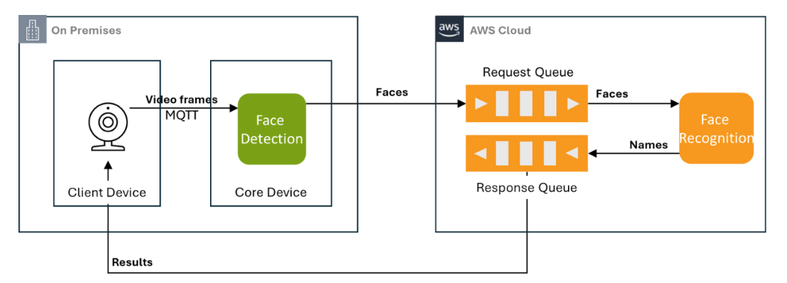

# Cloud Face Recognition Project

## Phase 4

The solution uses AWS IoT Greengrass and AWS Lambda to implement a distributed pipeline to recognize faces in video frames collected from Internet of Things (IoT) devices such as smart cameras.

- The pipeline starts with an IoT device, sending video frames to a Greengrass Core device using MQTT.
- The face detection program, running as a Greengrass component on the Core device, receives video frames, performs face detection using a machine learning model (MTCNN), and produces the detected faces.
- The detected faces are then sent to an SQS request queue, triggering the face-recognition function running on AWS Lambda. 
- The face recognition function performs face recognition on the detected faces using a ML model (FaceNet), and produces the classification results of the recognized faces.
- The recognition results are to an SQS response queue and retrieved by the IoT device.



### Greengrass Core Device Setup

#### Step 1: Setup Environment
```
sudo dnf install java-11-amazon-corretto -y
sudo useradd --system --create-home ggc_user
sudo groupadd --system ggc_group
sudo usermod -g ggc_group ggc_user
```

#### Step 2: Install Greengrass
```
curl -s https://d2s8p88vqu9w66.cloudfront.net/releases/greengrass-nucleus-latest.zip > greengrass-nucleus-latest.zip
 unzip greengrass-nucleus-latest.zip -d project2 && rm greengrass-nucleus-latest.zip

sudo -E java -Droot="/greengrass/v2" -Dlog.store=FILE -jar ./greengrass_installer/lib/Greengrass.jar  --aws-region us-east-1  --thing-name MyGreengrassCore  --thing-group-name MyGreengrassCoreGroup  --thing-policy-name GreengrassV2IoTThingPolicy  --tes-role-name GreengrassV2TokenExchangeRole  --tes-role-alias-name GreengrassCoreTokenExchangeRoleAlias  --component-default-user ggc_user:ggc_group  --provision true  --setup-system-service true  --deploy-dev-tools true

mkdir -p ~/greengrassv2/{recipes,artifacts}
```

#### Step 3: Create the FaceDetection Component

1. Add the recipe file (metadata) and artifacts (scripts)
2. Install required dependencies
```
sudo python3 -m pip install --no-cache-dir awsiotsdk boto3 numpy==1.24.4 torch==1.9.1+cpu torchvision==0.10.1+cpu torchaudio==0.9.1 --extra-index-url https://download.pytorch.org/whl/cpu
```
3. Deploy the component
```
sudo /greengrass/v2/bin/greengrass-cli deployment create --recipeDir ~/greengrassv2/recipes  --artifactDir ~/greengrassv2/artifacts  --merge "com.clientdevices.FaceDetection=1.0.0"
```
4. Check component list &  logs to verify success
```
sudo /greengrass/v2/bin/greengrass-cli component list
sudo tail -f /greengrass/v2/logs/com.clientdevices.FaceDetection.log
```
5. Additional commands
```
# Restart component
sudo /greengrass/v2/bin/greengrass-cli component restart --names "com.clientdevices.FaceDetection"
```

### Greengrass Client Device Setup

1. Create IoT Thing, Certificates, Policy
2. Associate the Greengrass Client device to Greengrass Core Device and add required policies


## Phase 3
A Cloud application using AWS PaaS resources (AWS Lambda) to provide face recognition as a service on video frames streamed from the clients (e.g., security cameras). The project implement a multi-stage pipeline to recognize faces in video frames collected from Internet of Things (IoTs) such as smart cameras.
- The pipeline starts with a client, which represents an IoT, sending video frames to the cloud app. 
- The face-detection function accepts video frames from the client, performs face detection using a machine learning model, and produces the detected faces.
- The face-recognition function performs face recognition on the detected faces using a machine learning model, and produces the names of the recognized faces. 
- The names of the recognized faces are sent back to the client.


## Phase 2
An elastic face recognition application using the IaaS resources from AWS. The application tier of the multi-tiered cloud application, uses a machine learning model to perform face recognition, and implement autoscaling to allow the application tier to dynamically scale on demand.


### Request API cURL

```
curl --location '<base_url>:<port>>/' \
--form 'inputFile=@"<file_location>"'
```

## Phase 1
A Cloud Application on AWS for Face Recognition. The project has two components: Web Tier and App Tier.

### Simple DB Setup
 
Populate the data from CSV into the SimpleDB

### Web Tier

Receives input files to perform face recognition.
In phase 1 of the project, the data is retrieved from AWS SimpleDB.

#### Run Commands

- Use Gunicorn to run the server.py
- Create systemd service files
- Run below commands to run the server:
```
sudo systemctl start server
sudo systemctl status server
```

